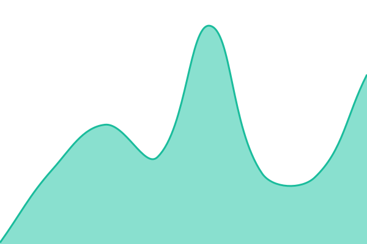

# [📈 Live Status](https://proteczi.github.io/sportzi-status): <!--live status--> **🟩 All systems operational**

This repository contains the open-source uptime monitor and status page for [proteczi](https://proteczi.github.io/sportzi-status), powered by [Upptime](https://github.com/upptime/upptime).

With [Upptime](https://upptime.js.org), you can get your own unlimited and free uptime monitor and status page, powered entirely by a GitHub repository. We use [Issues](https://github.com/proteczi/sportzi-status/issues) as incident reports, [Actions](https://github.com/proteczi/sportzi-status/actions) as uptime monitors, and [Pages](https://proteczi.github.io/sportzi-status) for the status page.

<!--start: status pages-->
<!-- This summary is generated by Upptime (https://github.com/upptime/upptime) -->
<!-- Do not edit this manually, your changes will be overwritten -->
<!-- prettier-ignore -->
| URL | Status | History | Response Time | Uptime |
| --- | ------ | ------- | ------------- | ------ |
|  [Web](https://sportzi.co/) | 🟩 Up | [web.yml](https://github.com/proteczi/sportzi-status/commits/HEAD/history/web.yml) | 

 317ms
     
 | 

<a href="https://status.sportzi.co/history/web">100.00%</a>
    

|  [API](https://api.sportzi.co/) | 🟩 Up | [api.yml](https://github.com/proteczi/sportzi-status/commits/HEAD/history/api.yml) | 

 347ms
     
 | 

<a href="https://status.sportzi.co/history/api">100.00%</a>
    

|  [Score](https://score.sportzi.co/) | 🟩 Up | [score.yml](https://github.com/proteczi/sportzi-status/commits/HEAD/history/score.yml) | 

 72ms
     
 | 

<a href="https://status.sportzi.co/history/score">100.00%</a>
    

|  [API Health (DB)](https://api.sportzi.co/health) | 🟩 Up | [api-health-db.yml](https://github.com/proteczi/sportzi-status/commits/HEAD/history/api-health-db.yml) | 

 359ms
     
 | 

<a href="https://status.sportzi.co/history/api-health-db">100.00%</a>
    

<!--end: status pages-->

[**Visit our status website →**](https://proteczi.github.io/sportzi-status)

## 📄 License

- Powered by: [Upptime](https://github.com/upptime/upptime)
- Code: [MIT](./LICENSE) © [Anand Chowdhary](https://anandchowdhary.com)
- Data in the `./history` directory: [Open Database License](https://opendatacommons.org/licenses/odbl/1-0/)
